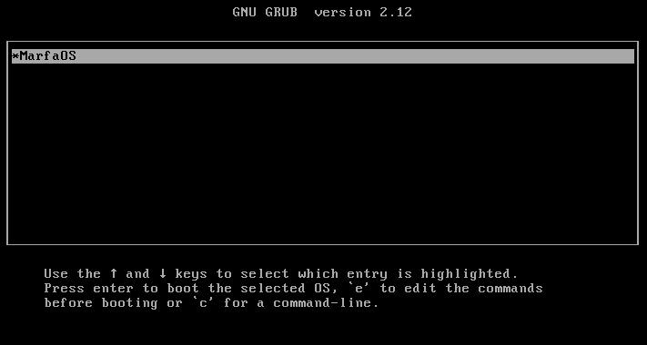
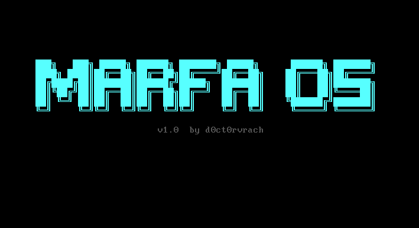
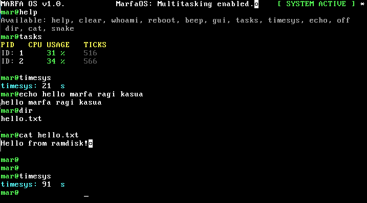
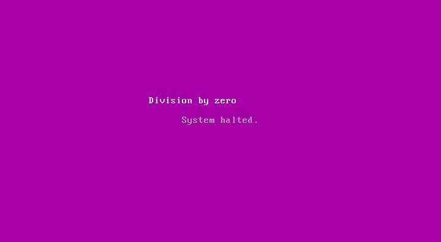

# MarfaOS V1.0

Hey everyone! My name is d0ct0rvrach, I'm a self-taught developer. 2 years ago I decided to step into the world of what people call low-level code. And I liked it, I liked it more than basic Python etc. A couple of months ago I started writing my own OS, I decided to name it after my cat Marfa — this is my first big project! Don't judge me! HAHAHA

> 32-bit x86 operating system written from scratch in C and Assembly.

## Features
- Multiboot protocol (GRUB compatible)
- VGA text mode shell with command history (↑/↓)
- Round-robin multitasking scheduler
- PS/2 keyboard driver with ring buffer
- Memory manager (bump allocator)
- FSOD — Fatal System (purple screen of death)
- Ramdisk — files loaded into RAM via GRUB modules
- Snake game (WASD controls)
- Boots on real hardware via USB flash drive

## Screenshots

**1) The system appears in GRUB! (When I launched it for the first time I was so hyped!)**



**2) Logo — made in blue tones, planning to change it to purple later**



**3) Shell — like Windows cmd but mine!**



**4) Snake! The first game in this OS, I don't plan to update it in the future — I'll leave it as a monument!**


**5) FSOD - An analogue of BSOD, currently triggers on only 2 reasons: division by zero and invalid memory access**

**The crash command divides by zero**



## Shell commands
| Command | Description |
|---------|-------------|
| `help` | Show available commands |
| `clear` | Clear screen |
| `whoami` | System info |
| `reboot` | Reboot system |
| `off` | Shutdown (ACPI) |
| `beep` | PC speaker beep |
| `timesys` | System uptime |
| `echo <text>` | Print text |
| `dir` | List ramdisk files |
| `cat <file>` | Print file contents |
| `snake` | Snake game |
| `crash` | Trigger FSOD |
| `gui` | Graphics mode |
| `tasks` | Show tasks |

## Build (WSL/Linux)
```bash
make clean && make
```

## Run in QEMU
```bash
make run
```

## Build ISO
```bash
make clean && make && cp marfa_os.bin iso/boot/ && grub-mkrescue -o marfa_os.iso iso/
```

## Boot on real hardware
Flash `marfa_os.iso` to USB drive using Rufus, then boot from USB.
Enable Legacy Boot / CSM in BIOS if needed.

## Stack
- NASM (assembler)
- GCC 32-bit (`-m32 -ffreestanding`)
- GNU ld with custom linker script
- QEMU for emulation
- GRUB2 for bootloading

## Author
**d0ct0rvrach**


